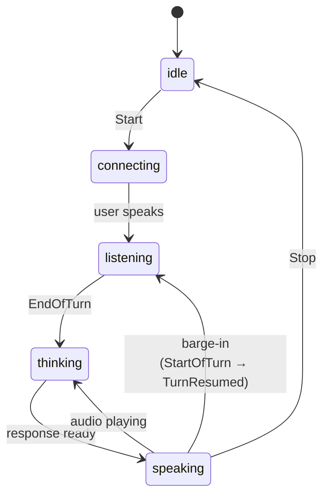

# Best Practices for Realtime Voice UI

This is the "resource" this project exists to establish: a set of behaviors a
realtime voice interface should get right, each paired with the code in this
repo that implements it. It's framework-independent — the ideas apply whether
you build with vanilla JS (as here), React, Vue, Svelte, or native.

The reference stack is **Deepgram Flux** for streaming speech-to-text and
**Deepgram Flux TTS** for streaming text-to-speech, connected **directly** (not
via the Voice Agent platform). There is deliberately **no LLM** — the demo echoes
your finished turn back to you so the full loop is exercised. The single point
where an LLM would slot in is marked in [`conversation.js`](public/src/conversation.js)
(`echoResponder` / the `respond` option).

---

## The mental model: a turn-taking state machine

A voice UI is a state machine, not a series of callbacks. Model it explicitly
and make the current state **visible** to the user at all times.



Implemented in [`conversation.js`](public/src/conversation.js) with a single
`state` variable and a `setState()` choke point. The UI
([`ui.js`](public/src/ui.js)) is a pure projection of that state onto the DOM.

---

## 1. Never put your API key in the browser

A key shipped to the browser is a key leaked to the world. Instead, keep it on a
server and mint **short-lived tokens** the browser uses to connect.

- Server: [`server/server.mjs`](server/server.mjs) exposes `GET /api/token`,
  which calls the Deepgram SDK's `auth.v1.tokens.grant({ ttl_seconds })` and
  returns `{ access_token, expires_in }`. The key is read from the environment
  and never serialized to the client. The response is sent `Cache-Control: no-store`.
- Client: [`token.js`](public/src/token.js) fetches a token right before
  connecting and caches it only until just before it expires.

**Why a token even works for a long call:** a Deepgram token only needs to be
valid for the WebSocket **handshake**. Once the socket is open, the token
expiring does not close it. So a 30–60 second TTL is plenty.

**Verify it:** `grep -ri DEEPGRAM_API_KEY public/` returns nothing.

## 2. One explicit state, always visible

Users must never wonder "is it listening to me?" Every state
(`idle · connecting · listening · thinking · speaking · error`) maps to a
visible indicator. See the status dot + label in [`index.html`](public/index.html)
and the `[data-state]`-driven styles in [`styles.css`](public/styles.css).

Anti-pattern: inferring UI from scattered booleans (`isRecording`,
`isPlaying`, `hasError`) that can contradict each other.

## 3. Let the model do turn-taking (Flux events)

Detecting when a user has finished a thought is hard. Flux does it for you and
emits `TurnInfo` events — handled in `handleSTTEvent()` in
[`conversation.js`](public/src/conversation.js):

| Flux event | Meaning | What the UI does |
|---|---|---|
| `StartOfTurn` | user began speaking | reset interim text; **barge-in** if agent was talking |
| `Update` | more of the turn transcribed | update interim transcript |
| `EagerEndOfTurn` | probably done | *(hook to pre-warm an LLM request)* |
| `TurnResumed` | false alarm, still talking | cancel any speculative response |
| `EndOfTurn` | user finished | commit the turn, respond |

This is why we chose Flux (`/v2/listen`) over Nova (`/v1/listen`) for a voice
UI: with Nova you'd reconstruct this from `endpointing`, `SpeechStarted`, and
`UtteranceEnd` yourself.

## 4. Barge-in is non-negotiable

The signature of a *good* voice UI: the user can interrupt the agent by
talking, and the agent stops **immediately**. When `StartOfTurn` arrives while
audio is playing, `interrupt()` in [`conversation.js`](public/src/conversation.js):

1. reads `player.playedMs` — how much of the turn actually reached the speakers,
2. `player.flush()` — stops every scheduled audio source locally (instant), and
3. `tts.interrupt(playedMs)` — tells Deepgram to drop audio it has buffered but
   not yet sent.

All three matter. (1) and (2) must happen in that order, because `flush()` resets
the player's timeline. (2) kills what's already in your speakers; (3) stops more
audio arriving over the wire. We also guard against a *late* response: if the
user barges in while we're still "thinking", `commitTurn()` checks the
`turn_index` and abandons the stale reply.

**Why report how much was heard.** On Flux TTS (`/v2/speak`) the interrupt
message carries an optional `playback_offset`, and Deepgram answers with
`SpeechInterrupted` — `text_spoken` and `text_remaining`, an exact account of
what the listener did and didn't hear. That is the hard half of agent state
reconciliation, and it keeps your LLM's conversation history honest: without it
you have to reconstruct the cut-off point from playback timing, or record the
whole reply as spoken when the user only heard the first sentence.

Send the offset from the *client*, not the server's own count. The server knows
what it sent; the browser knows what it played, and those differ by whatever is
still scheduled in the Web Audio graph. `playedMs` is capped at the scheduled
duration precisely because the audio clock runs ahead of the queue between
chunks. (Omitting `playback_offset` is legal — Deepgram then reports
`audio_played_ms` from its own totals, which overcounts.)

On the older Aura endpoint (`/v1/speak`) the equivalent is a bare `Clear` with no
offset, so `tts.interrupt()` sends that instead and ignores the argument — one
call site, either generation.

## 5. Show VAD feedback

A live mic-level meter tells the user they're being heard even before any words
are transcribed. The [`pcm-worklet.js`](public/pcm-worklet.js) computes an RMS
level on the audio thread and posts it up; [`ui.js`](public/src/ui.js) drives a
meter bar. Combined with the status dot, the user always knows whether the app
is hearing them.

## 6. Capture audio correctly

- Use an **`AudioWorklet`** ([`pcm-worklet.js`](public/pcm-worklet.js)), not the
  deprecated `ScriptProcessorNode` — the worklet runs on the audio thread and
  won't glitch under main-thread load.
- **Resample** from the AudioContext's native rate (often 48 kHz) down to the
  16 kHz `linear16` Flux expects, and packetize into **~80 ms chunks**
  (Deepgram's recommended streaming granularity).
- Enable **echo cancellation** on `getUserMedia` ([`mic.js`](public/src/mic.js)).
  Without it, TTS output bleeds into the mic and falsely triggers turn events.
- **Never send an empty audio frame** — Deepgram treats a zero-length binary
  frame as a stream close. Guarded in [`stt.js`](public/src/stt.js).

## 7. Play streamed audio gap-free

Don't play each TTS chunk "now" — schedule each on a running timeline so chunks
abut sample-accurately. [`player.js`](public/src/player.js) tracks `nextTime`
and starts each `AudioBufferSourceNode` exactly where the previous one ends. A
single AudioContext also lets `flush()` stop everything instantly for barge-in.

Remember: an `AudioContext` starts suspended until a user gesture. We call
`player.resume()` from inside the Start click.

## 8. Connect and tear down cleanly

- On **stop**, release everything: stop the mic tracks (turns off the OS mic
  indicator), send `CloseStream` to flush STT, `Close` the TTS socket, and close
  the AudioContext. See `stop()` in [`conversation.js`](public/src/conversation.js).
- Send audio only while the socket is `OPEN`; guard every `send`.
- **Reconnect caveat:** each new STT connection restarts timestamps at zero. If
  you keep a running transcript timeline across reconnects, add an offset.
- **Don't** cycle the TTS socket between turns — that's what keeps cross-turn
  context alive (#12).

## 9. Accessibility

- Status changes are announced with `aria-live="polite"` / `role="status"`;
  errors use `role="alert"`.
- Controls are real `<button>`s, keyboard-operable, with visible focus rings.
- The mic meter is `aria-hidden` (decorative) — meaning is carried by the text
  status, not color/animation alone.
- All motion is disabled under `prefers-reduced-motion`.

## 10. Handle permissions and failures in the UI

Surface problems where the user can see them, not just the console
([`app.js`](public/src/app.js)):

- **Preflight**: check `isSecureContext`, `getUserMedia`, and `AudioWorklet`
  support before enabling Start (mic capture requires https or `localhost`).
- Map `NotAllowedError` / `NotFoundError` to plain-language messages.
- On any socket error, fail the session into the `error` state rather than
  hanging in a half-open state.

## 11. Keep the response logic pluggable

The demo's "brain" is a one-liner (`echoResponder`) behind a `respond(text)`
seam in [`conversation.js`](public/src/conversation.js). To make this a real
assistant, replace it with a call to your LLM (it may return a `Promise<string>`,
or you can stream tokens straight into `tts.speak()` as they arrive). Everything
else — capture, turn-taking, barge-in, playback, teardown — stays the same.

## 12. Keep one TTS socket for the whole session

Flux TTS (`/v2/speak`) carries its **acoustic state** — prosody, tone, pacing —
across turns, so turn 10 sounds like a continuation of turn 1 instead of a cold
start. This is *cross-turn context*, and it's worth knowing two things about it:

- **There is no flag.** It's simply how `/v2/speak` behaves. Nothing to enable.
- **A new connection resets it.** The state lives on the socket. `Flush` (end of
  turn) and `Interrupt` (barge-in) both preserve it; only `Close` or a reconnect
  drops it.

So socket lifetime is a *correctness* concern, not just an efficiency one.
Opening a TTS socket per turn — a tempting simplification — costs you a
handshake on every reply and silently makes the voice restart cold each time.
Open it once in `start()` and close it only in `stop()`, as
[`conversation.js`](public/src/conversation.js) does.

Note that the context is the model's own prior *generations* — not the user's
audio, not their words, not your LLM's reasoning. It makes the voice coherent;
it doesn't make the model aware of the conversation. Conversational memory is
still your responder's job (#11).

**One-hour cap:** Deepgram ends a session after an hour. A session that can run
that long needs to reconnect — and the voice will reset at that seam. The
examples here don't reconnect; they surface the close as an error (#10), which
is the honest behavior for a demo but not enough for production.

See [Cross-Turn Context](https://developers.deepgram.com/docs/flux-tts/context).

Aura (`/v1/speak`) has no equivalent — each turn is synthesized independently.

---

## A note on the SDK and the browser

This project uses `@deepgram/sdk` **server-side only**, to mint tokens. The
browser talks to Deepgram over **raw WebSockets**. That's deliberate: in v5 the
SDK's streaming clients authenticate with an HTTP `Authorization` header, which
browsers can't set on a WebSocket, and the Speak socket JSON-parses every frame
(so it can't surface binary audio). The browser-native path is:

```js
// API key (server-side or trusted env):  ["token", API_KEY]
// Short-lived token (browser):            ["bearer", accessToken]
new WebSocket("wss://api.deepgram.com/v2/listen?model=flux-general-en&…",
              ["bearer", accessToken]);
```

Sending raw WebSocket frames also makes the protocol explicit, which is useful
for a teaching resource. See [`stt.js`](public/src/stt.js) and
[`tts.js`](public/src/tts.js).
