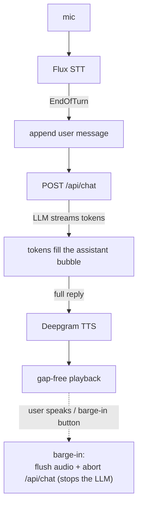

# React + shadcn/ui — A Modern Voice Chat

The realtime voice UI from [`../../examples/reactjs`](../../examples/reactjs) — start/stop, voice-activity
feedback, turn-taking, and barge-in — rendered as a modern chat built with
**[shadcn/ui](https://ui.shadcn.com)** and **Tailwind CSS**, and answered by a
real LLM through a small streaming `/api/chat` endpoint. For the *why* behind
every voice behavior, read the shared guide:
[**BEST_PRACTICES.md**](../../BEST_PRACTICES.md).

> This is the [`../../examples/reactjs-copilotkit`](../../examples/reactjs-copilotkit) example with the
> chat UI and the LLM plumbing **owned by us** instead of delegated to CopilotKit.
> We render every message with our own shadcn components and stream replies from
> our own endpoint — the voice engine underneath is byte-for-byte the same.

## The idea: split the job cleanly

| Role | Owner |
|---|---|
| **Ears** — streaming STT, turn detection (Flux) | Deepgram |
| **Mouth** — streaming TTS, gap-free playback, barge-in | Deepgram |
| **Brain** — the LLM that answers | `/api/chat` → OpenAI (server-side) |
| **Chat UI** — the visible, typeable conversation | our own shadcn/ui components |

Because the input is just text by the time a turn is committed, **you can also
type** into the chat — it's the same conversation either way.

## How it flows



## How it maps to React

The realtime machinery is **framework-agnostic** and shared, almost verbatim,
with the vanilla, React, and CopilotKit examples — capture, sockets, playback,
and the state machine are plain modules under [`src/lib/`](src/lib/). shadcn/ui
and the LLM call live only at the edges.

| Concern | Where it lives |
|---|---|
| State machine (idle → connecting → listening → thinking → speaking) | [`src/lib/conversation.js`](src/lib/conversation.js) |
| Mic / STT / TTS / player / token / config | [`src/lib/`](src/lib/) (unchanged) |
| React seam — callbacks → state, one instance, teardown | [`src/hooks/useConversation.js`](src/hooks/useConversation.js) |
| **Brain + message store** — `respond`, `sendTyped`, barge-in abort | [`src/hooks/useChat.js`](src/hooks/useChat.js) |
| **Streaming LLM endpoint** (holds the LLM key) | [`server/server.mjs`](server/server.mjs) (`POST /api/chat`) |
| UI — chat card, bubbles, composer | [`src/App.jsx`](src/App.jsx), [`src/components/`](src/components/) |
| **shadcn/ui components** (Button, Card, ScrollArea, Avatar, …) | [`src/components/ui/`](src/components/ui/) |

The only change to the shared orchestrator is one integration seam,
`onResponseInterrupted`: because the "brain" is a remote LLM streaming a reply,
barge-in has to stop **generation** as well as audio. Everything else in
[`conversation.js`](src/lib/conversation.js) is identical to the plain examples.

### The brain, in one paragraph

[`useChat`](src/hooks/useChat.js) holds the message list and exposes `respond(text)`
to the voice orchestrator: it appends the user's turn plus an empty assistant
bubble, `POST`s the history to `/api/chat`, and streams the reply token-by-token
into that bubble — resolving with the full text so the orchestrator can speak it.
`onResponseInterrupted()` aborts that `fetch` on barge-in; the server sees the
socket close and aborts the upstream LLM call too, so you stop paying for tokens
no one will hear. Typed messages go through `sendTyped()` — same streaming, but
the reply isn't spoken (you typed, so you're reading).

## About shadcn/ui in this example

shadcn/ui isn't an npm component library — it's a collection of component
**source files you copy into your project** and own. The files under
[`src/components/ui/`](src/components/ui/) (Button, Textarea, Card, Badge,
Separator, Avatar, ScrollArea) are exactly what the shadcn CLI/MCP emits; they're
vendored here so the example is self-contained. [`components.json`](components.json)
records the config, and the `@/*` import alias resolves via
[`vite.config.js`](vite.config.js) + [`jsconfig.json`](jsconfig.json).

To add more components with the [shadcn MCP server](https://ui.shadcn.com/docs/mcp)
(configured for this repo in the root `.mcp.json`) or the CLI, from this folder:

```sh
npx shadcn@latest add dialog dropdown-menu tooltip
```

They'll land in `src/components/ui/` alongside the ones already here.

Theming is driven by the CSS custom properties in [`src/index.css`](src/index.css).
Light/dark follows the OS via `prefers-color-scheme` (no theme toggle needed), so
the chat matches the rest of the demos (Best practice #9).

## Quick start

Requires **Node 18+**, a Deepgram API key ([console.deepgram.com](https://console.deepgram.com)),
and an OpenAI API key ([platform.openai.com](https://platform.openai.com)).

```sh
npm install
cp .env.example .env      # then set DEEPGRAM_API_KEY and OPENAI_API_KEY
npm run dev
```

`npm run dev` runs two processes via `concurrently`:

- **server** (`:3000`) — the Node server: `/api/token` (Deepgram) **and**
  `/api/chat` (the LLM). Holds both keys.
- **client** (`:5173`) — Vite dev server; proxies `/api/*` to the server.

Open **http://localhost:5173**, click **Listen**, allow the mic, and speak.
Pause, and the LLM answers out loud. Talk over it — or click the **barge-in**
button — to cut it off instantly (which also stops the model). You can type in
the chat box at any time.

> Use `http://localhost` (or https). Microphone capture is blocked on insecure
> origins.

## Production

```sh
npm run build     # emits ./dist
npm start         # build + serve ./dist, /api/token, and /api/chat on :3000
```

In production there's no proxy: the Node server serves the built app **and**
both API endpoints from the same origin.

## Keys never touch the browser

Best practice #1 applies to **both** providers:

- The **Deepgram** key mints short-lived browser tokens; the browser opens
  STT/TTS WebSockets directly with those tokens.
- The **OpenAI** key stays on the server; the browser talks to the LLM only
  through `/api/chat`.

`grep -ri "OPENAI_API_KEY\|DEEPGRAM_API_KEY" src/` returns nothing.

## Swapping the LLM provider

`/api/chat` uses the OpenAI SDK against `OPENAI_BASE_URL`, so any
OpenAI-compatible endpoint (Azure OpenAI, Groq, Together, a local server, …)
works by setting `OPENAI_BASE_URL` and `OPENAI_MODEL` in `.env`. For a
non-compatible provider, swap the `openai.chat.completions.create(...)` call in
[`server/server.mjs`](server/server.mjs) for that provider's streaming API and
keep writing text chunks to the response — the client just reads a text stream.

## Streaming TTS (optional upgrade)

This example speaks each reply once generation **completes**, which keeps the
brain simple. To start speaking sooner, split the streamed text into sentences as
it arrives in [`useChat`](src/hooks/useChat.js) and feed each into `tts.speak()`
as it completes (Best practice #11). The capture / turn-taking / barge-in /
playback machinery stays the same.
